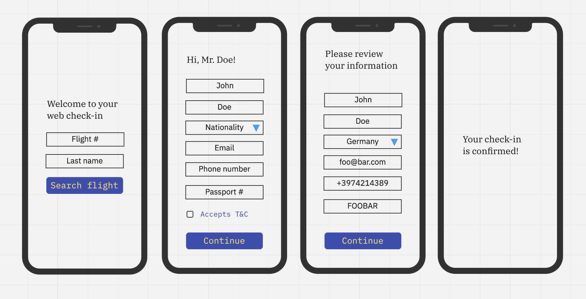

# 

## Frontend Engineer exercise

### The scenario

The user wants to do check-in on the way to the airport using a mobile phone.

- How we want to user to do it:
  - The user should provide his flight number and last name
  - Afterwards, fill a simple form with basic information based on his nationality
  - The user should be able to review the information before confirming
  - Confirm the check-in! :)

- Every user should provide the following basic info: **full name**, **nationality**, **phone number**, **e-mail**, **passport number** and **terms & conditions acceptance**.
- Depending on the user's nationality, a few extra fields should be required:
  - Austria:
    - residence (country and city only)
    - passport expiry date
  - Belgium:
    - birth date
    - residence (country, city and address)
  - France:
    - birth date
    - birth place
    - residence (country and city only)
  - Greece:
    - passport date of issue
    - passport location of issue (country and city)
    - passport expiry date
  - Spain:
    - residence (address only)

**There is a wireframe suggestion at the end of this README. Feel free to follow it or not.**

### Must be / use / have

- Responsive!
- A design system / component your library of your preference e.g. Material, Tailwind, Bulma, etc.
- Basic testing with Jest and testing-library
- Any fake API free service to do all async operations: checking flight number + last name combination, sending the users data and getting the response back. Some options: fakejson.com, mocki.io, dummyapi.io.

### The deliverable

A public Github repository containing your exercise: A small React single page application to do web check-in for flights

- Host it on your go-to service e.g. Vercel, Netlify, S3. All of these have generous free-tiers.
- A basic README with how a new engineer can contribute to the project.

### How we will evaluate your exercise

Besides the skills we listed on this repository root, for the exercise we look for three skills we believe a engineer should have: **code craftsmanship**, **attention to detail** and **team work**.

### **How to submit**

After completing the exercise, please forward the link to your Github repository for this exercise to inacio.schweller@cosi-group.com

### Sample wireframe

